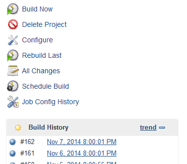
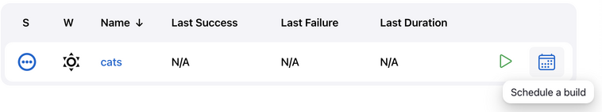
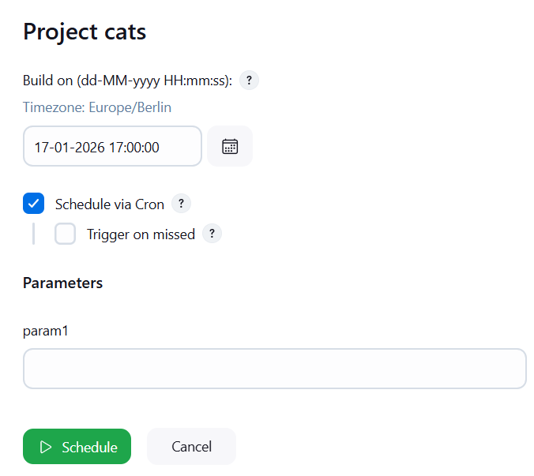
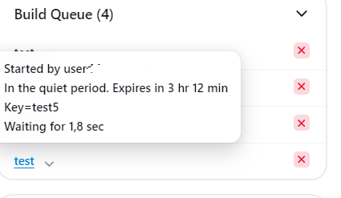
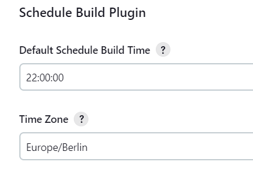

# Schedule Build plugin

Adds capability to schedule a build for a later point in time. Asks the
user for a date and time and adds the build to the build queue with the
respective quiet period.

## Scheduling Builds

Press the "Schedule Build" link on the project page or use the schedule
build action in the list view.



  
Then select date and time when to schedule the build.

  
The build will be added to the build queue with the respective quiet
period.



## Configure Schedule Build Plugin

The configuration of the schedule build plugin is very simple. There are
only two parameters on the Jenkins system configuration page.

The default time which is set when a user wants to schedule a build may
be configured and time zone used by the plugin, which might differ from
the system time zone.



## Configuration as code

This plugin supports configuration as code

Add to your yaml file:
```yaml
unclassified:
  scheduleBuild:
    defaultScheduleTime: "11:00:00 PM"
    timeZone: "Europe/Paris"
```
