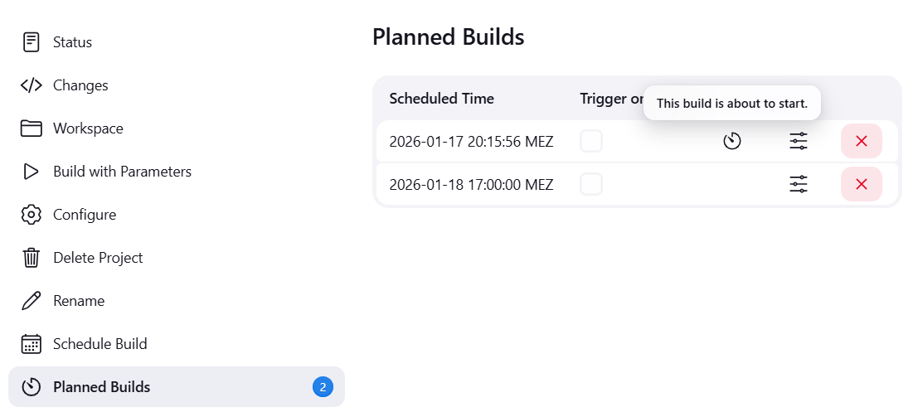

# Schedule Build plugin

Adds capability to schedule a build for a later point in time by asking for date and
time and parameters if applicable.
The plugin offers 2 ways how to schedule the build. 
- Adding the run to the queue immediately with a quiet period calculated from the selected date and time.
- Using cron-like scheduling to plan the build for a specific date and time. This mode offers additional features.

## Scheduling Builds

Press the "Schedule Build" link on the project page


or use the schedule build action in the list view.

  

Then select date and time when to schedule the build and set options and parameters.

  

If selected the build will be added to the build queue with the respective quiet
period.


Alternatively, if the "Use cron-like scheduling" option is selected:



## Scheduling via Queue

To schedule a build via the queue, simply select the desired date and time, don't check `Schedule via Cron` 
and set any parameters if applicable.
When pressing the `Schedule` button, the build will be added to the queue with a quiet period 
calculated from the selected date and time. Due to Jenkins deduplicating builds in the queue, if a build for 
the same job is added with identical parameters, the existing build in the queue will be updated to the new 
quiet period instead of adding a new build to the queue. That means if you start the build with `Build Now` 
before the scheduled time, the scheduled build will be removed from the queue and the job will run 
immediately. This also means that the job will start to run immediately after a Jenkins restart when Jenkins 
was down at the scheduled time.

## Scheduling via Cron

To schedule a build via cron, simply select the desired date and time, check `Schedule via Cron`
and set any parameters if applicable. 

When pressing the `Schedule` button, the build will be added to the list of planned builds for the job. At the scheduled date 
and time, a new build will be created with the selected parameters.

Multiple builds can be scheduled for the same job with identical parameters at different times when they at least differ by a second.
The scheduled builds are persistent and will survive Jenkins restarts.

If a build is missed because Jenkins was down, it will be started immediately if the option `Trigger 
on missed` is set. Without that option, the build will be skipped. There is a configurable grace 
period to still trigger the build after the scheduled time.

Builds scheduled via cron have a dedicated Cause.

Renames or moves of jobs are supported. The scheduled builds will follow the job.

The `Planned Builds` view offers the ability to cancel scheduled builds.

## Configure Schedule Build Plugin

The configuration of the schedule build plugin is very simple. There are
only three parameters on the Jenkins system configuration page.

The default time which is set when a user wants to schedule a build may
be configured, time zone used by the plugin, which might differ from
the system time zone and the grace period for missed builds even when `Trigger on missed` 
is not set.


## Configuration as code

This plugin supports configuration as code

Add to your yaml file:
```yaml
unclassified:
  scheduleBuild:
    defaultStartTime: "11:00:00 PM"
    timeZone: "Europe/Paris"
    gracePeriodMinutes: 3
```

## Release Notes

* For recent versions, see [GitHub Releases](https://github.com/jenkinsci/schedule-build-plugin/releases)
* For versions 0.5.0 and older, see the [changelog archive](https://github.com/jenkinsci/schedule-build-plugin/blob/schedule-build-1.0.0/CHANGELOG.md)

## Report an Issue

Please report issues and enhancements through the [Jenkins issue tracker](https://www.jenkins.io/participate/report-issue/redirect/#18422).
